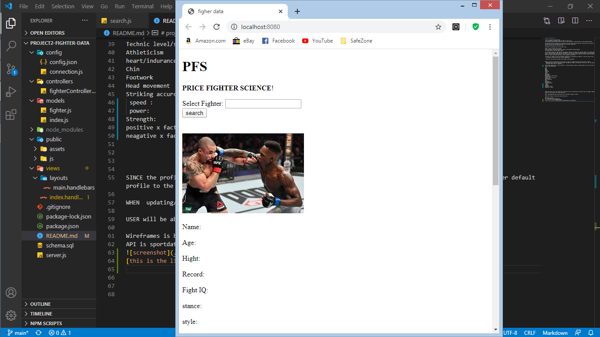

# project2-fighter-data

This is my project two concept app.
 with a skeleton for adding a front end. Most of the my work 
Was backend and getting everything or least all files and folders linked together to have something working.

My challenges were not being able to be good at the front end or the back, and felt like jack of all traits but  master of none.  but was able to make a api call and use bulma on handlebars.
bulma frame work was a fairly easy to use.

Sportdata for developer api was also easy to use.

mysql is where I had the most trouble.
With not having a working refrence for syqualize and handlbars working together.
so avoided going on two day rabbit chase.

Price Fighter Science aka “PFS” app has everything you need to know about your favorite fighter, for casuals and fight purist. The app features a data base of top fighters. The app is a  place to inform the user of the best fighters on the planet, and also a place where the user can end or start  fun debate with friends and coworker about upcoming bouts, with real live  data from a sport data api, on the  fighters profile card.

 Why data on a fighter profile card? Because reading data on paragraph and sentences  is boring. Profile cards  is a easy to read data structure on the user favorite competitor..

 And why not use that data to make a smart wager in online betting.

 
WHEN user enters the page they are given options on which two fighter profile card they want to compare.
  AFTER they select the two they want to view  the page will render at the bottom of the screen  the  two player card displayed side by side for comparison

When viewing fighter data. five star system, or a below average, average, or above average  score will be given to rate fighter last performance.

Name:
Age:
Hight 
Record
Fight IQ: 
stance
style
Nationality
gym/coach
Conditioning/ fitness/cardio
Disciplines:
Technic level/skill level
Athleticism
heart/indurance 
Chin
Footwork
Head movement
Striking accurcy: 
 speed : 
 power: 
Strength: 
positive x factor:
neagative x factor:

SINCE the profile card will contain some information that can change month to month the user can change a fighter default profile to the current  age, record and coach

WHEN  updating/delete Only certain data will be allowed to update or delete. 

USER will be able to create their own profile card.

Wireframes is bulma
API is sportdata for developer api

[this is the link to the page](https://project2-fighter-data.herokuapp.com/)

 
